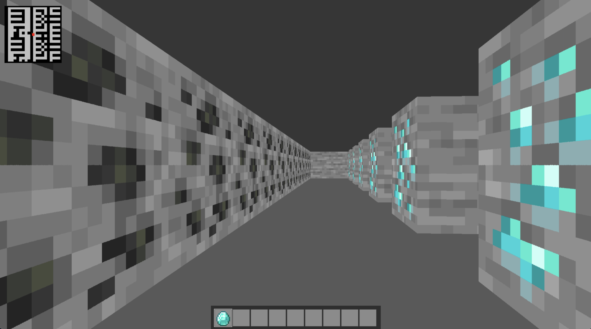
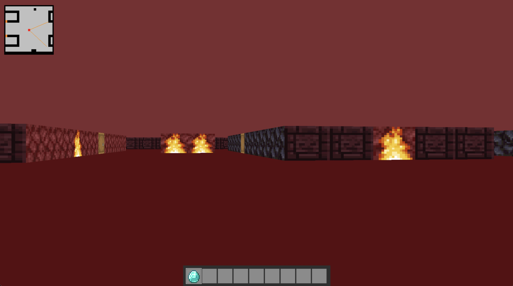
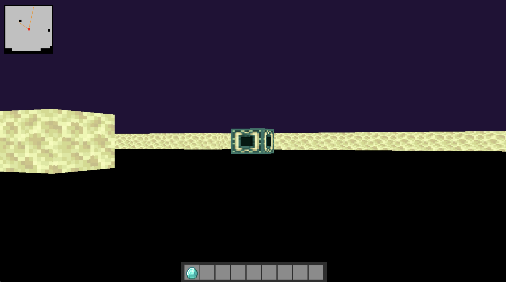

*This project has been created as part of the 42 curriculum by rlarbi, boschwie.*

# cub3D (Minecraft Edition)

## Description

**cub3D** is a graphical project from the 42 curriculum inspired by **Wolfenstein 3D**, based on the **raycasting** technique.
The goal of this project is to create a simple real-time 3D engine using **MiniLibX**, allowing the player to navigate inside a world described by a `.cub` configuration file.

For this project, we chose a **Minecraft-inspired theme**, using custom textures and multiple maps to recreate different Minecraft dimensions while respecting all cub3D constraints.

This repository contains two variants of the project:

- **Mandatory**: minimal feature set required by the subject.
- **Bonus**: adds extra gameplay/features (doors, animations, minimap, teleport, animated sprites, etc).

---

## Theme: Minecraft

The entire project is designed around a **Minecraft theme**.

We created **three different maps**, each inspired by a Minecraft dimension:

- **⛏ Mine** — Classic Minecraft mining environment



- **🔥 Nether** — Dark and hostile atmosphere



- **🐉 End** — Minimalist and mysterious dimension



Maps are provided in the maps/ directories, in both versions of the project. Example paths :

- maps/mine.cub
- maps/nether.cub
- maps/end.cub

Each map:
- Has its own `.cub` configuration file
- Uses different textures
- Offers a unique visual ambiance

---

## Features

- Raycasting-based 3D rendering
- Minecraft-inspired textures
- Three playable maps (Mine, Nether, End)
- Wall textures for all directions (NO / SO / WE / EA)
- Floor and ceiling color management
- Collision detection
- Smooth and responsive player movement
- Camera rotation using **mouse** and/or **arrow keys**
- A **minimap** system
- Doors which can open and close
- Animated sprites
- Teleport / portal handling
- Minimal pause / resume state

---

## Instructions

### Requirements

- macOS or Linux
- `gcc` or `cc`
- `make`
- MiniLibX (provided by 42)
- Internet access (to clone MLX repository)

### Compilation

Compile the project by running:

```bash
make
```

## Execution

Run the program with a specific map file:

```bash
./cub3D maps/nether.cub
```
or
```bash
make run
```

You can also run the other available maps:

```bash
./cub3D maps/overworld.cub
./cub3D maps/end.cub
```
or
```bash
make run [ARGS=...]
```
*(**ARGS** is the path to a map, set to maps/nether.cub by default)*

---

## Controls

### Movement (QWERTY keyboard)

* **W** → Move forward
* **S** → Move backward
* **A** → Strafe left
* **D** → Strafe right

### Camera / View

* **Mouse movement** → Rotate the camera view
* **← / →** Rotate the camera using arrow keys

### Pause

* **P** → Pause / resume the program

### Exit

* **ESC** key or **window close button** → Exit the program cleanly

---

## Project Structure

```
.
├── Mandatory/
│ ├── Assets
│ ├── Makefile
│ ├── src/
│ ├── inc/
│ ├── maps/
│ └── libft/
├── Bonus/
│ ├── Assets
│ ├── Makefile
│ ├── src/
│ ├── inc/
│ ├── maps/
│ └── libft/
└── README.md
```

---

## Resources

### References

* **Raycasting tutorial (Lode Vandevenne)**
  [https://lodev.org/cgtutor/raycasting.html](https://lodev.org/cgtutor/raycasting.html)

* **MiniLibX documentation (42)**
  [https://harm-smits.github.io/42docs/libs/minilibx](https://harm-smits.github.io/42docs/libs/minilibx)

* **Wolfenstein 3D overview**
  [https://en.wikipedia.org/wiki/Wolfenstein_3D](https://en.wikipedia.org/wiki/Wolfenstein_3D)

* **GIF Raycasting**
  [https://www.lexaloffle.com/bbs/?tid=40619](https://www.lexaloffle.com/bbs/?tid=40619)

* **cub3D subject** (42 curriculum)

---

## Implementation overview (architecture & core logic)

This section briefly describes the main design choices and the runtime flow used to implement cub3D.

Parsing & map
- Token-first parsing: read file line-by-line, parse texture paths and RGB colors first, then collect map lines.
- Map collection: accumulate contiguous map lines into a buffer, then pad lines to build a rectangular grid (padding uses ' ').
- Validation: check tokens, ensure exactly one player start, verify map enclosure (no leaks through spaces) and valid characters.

Raycasting
- DDA (Digital Differential Analyzer) for a column-wise, grid-stepped raycast — simple, deterministic, and performant for this project size.
- Per-ray steps:
  - Compute ray direction from camera plane + player dir.
  - Compute initial sideDist and deltaDist.
  - Step cell-by-cell along X/Y until a wall (or interactive tile like door) is hit.
  - Compute perpendicular distance to avoid fisheye, calculate line height.
  - Sample the correct texture column using wall hit position and render the vertical stripe.

Rendering (per frame)
- Input handling updates player position, direction, and interaction state.
- For each screen column:
  - Cast a DDA ray, find wall hit, compute distance and texture x coordinate, write vertical slice to an offscreen image buffer.
- Sprite handling:
  - Collect visible sprites, sort by distance (far → near), transform to camera space, compute screen rectangle, draw with transparency.
  - Animated sprites use frame indices advanced by a timer.
- Floor & ceiling:
  - Simple vertical-fill per column (color) or optional floor-casting if implemented.
- Minimap:
  - Draw the map grid scaled down, overlay player and FOV sector.
- Final step: push the composed image to the window (mlx_put_image_to_window).

---

## AI Usage

AI tools were used **only as an educational support**, mainly to:

* Provide guidance to oragnise and determine workload
* Understand and apply mathematical formulas used in raycasting
* Clarify trigonometry concepts (angles, distances, vectors)
* Help translate mathematical theory into working C implementations
* Assist with debugging and algorithm reasoning
* Help with markdown and README.md creation


All implementations were **fully understood, adapted, and written by us**, in full compliance with the **42 school rules**.
